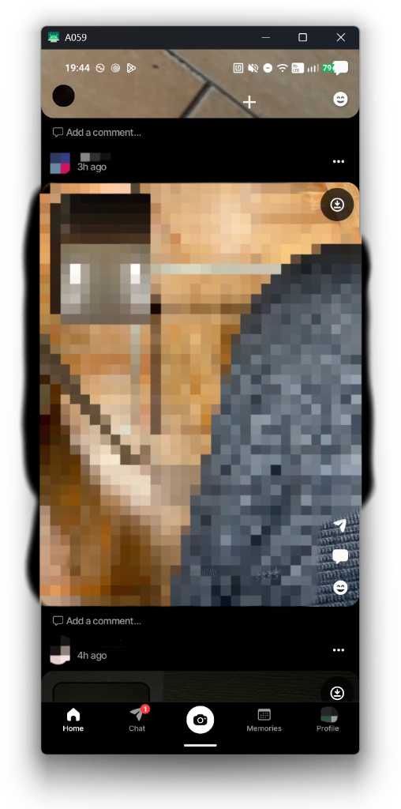
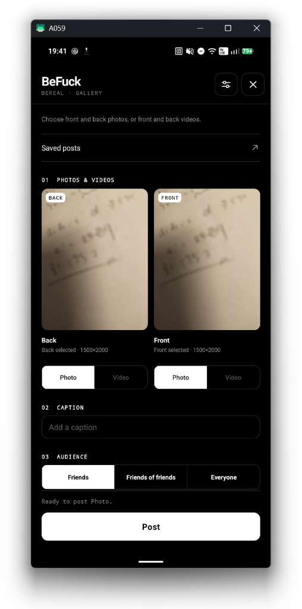
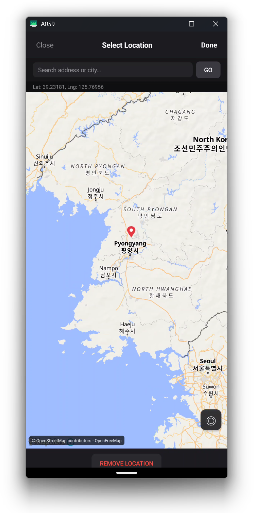
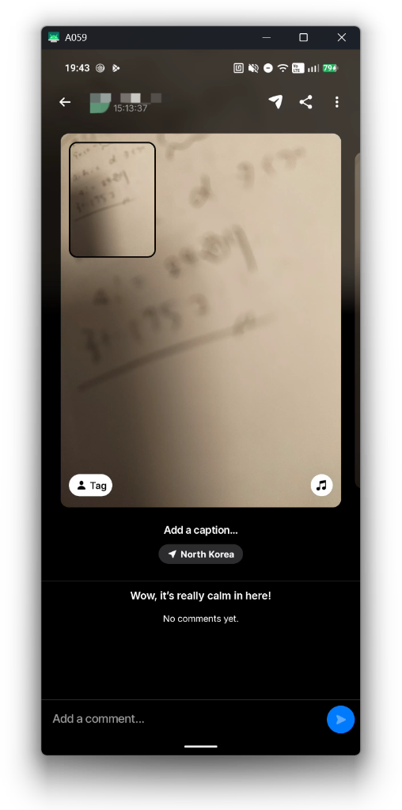
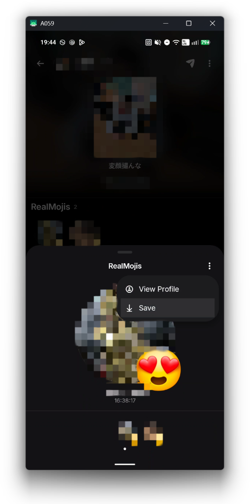

# BeFuck

[English](README.md) · [简体中文](README.zh-CN.md) · [日本語](README.ja.md) · [한국어](README.ko.md)

BeReal의 기능을 확장하는 Xposed 모듈입니다.  
**LSPosed** 및 **NPatch**를 지원합니다.  
지원 버전: **3.97.0 (3597523)** / **3.97.1 (3599414)** (`com.bereal.ft`).

## 스크린샷

| 흐림 해제 및 저장 | 갤러리 게시 | 위치 선택 |
| :---: | :---: | :---: |
|  |  |  |

| 게시 완료 (시간 및 위치 위조) | RealMoji 저장 |
| :---: | :---: |
|  |  |

## 주요 기능

- **흐림 효과 해제**: 피드와 게시물의 블러를 해제하여 바로 확인합니다.
- **미디어 저장**: 사진, 동영상(BTS), RealMoji를 기기에 고화질로 저장합니다 (촬영 일시 유지).
- **갤러리 게시**: 기기의 사진이나 동영상을 BeReal에 직접 게시합니다 (자르기, 위치, 늦은 게시 지원).
- **광고 숨김**: 피드의 스폰서 게시물과 광고를 숨깁니다.
- **저장된 목록**: 피드에서 불러온 게시물을 언제든지 다시 확인하고 다운로드합니다.

## 설치 및 사용법

1. 모듈을 설치하고 LSPosed 등 프레임워크에서 활성화(또는 NPatch로 APK 패치)한 후, 범위를 **BeReal (`com.bereal.ft`)**로 지정합니다.
2. BeReal을 실행합니다.
3. 홈 화면 제목 옆의 **+** 아이콘을 탭하여 갤러리 게시, 저장된 게시물 목록, 설정을 엽니다. 게시물 메뉴에서도 바로 저장할 수 있습니다.

> [!NOTE]
> **로그인 안내**:
> - **v0.3.0 이상**: 전화번호 SMS 인증 로그인도 가능하도록 수정되었습니다.
> - **v0.2.0 이하 버전 또는 로그인 실패 시 대처법**:
>   - 모듈이 활성화(후킹)된 상태에서는 전화번호 SMS 인증 로그인이 실패할 수 있습니다 (이메일 로그인은 정상 이용 가능).
>   - SMS 로그인을 이용하려면 먼저 모듈을 비활성화한 상태에서 로그인을 완료한 후 모듈을 활성화(후킹)하세요.
>   - NPatch 등 임베디드 환경에서 로그인이 되지 않는 경우 **이메일 로그인**을 이용해 보세요.

저장 위치: `Pictures/BeFuck` 또는 `Movies/BeFuck`.

## 빌드

JDK 17 이상 및 Android SDK가 필요합니다.

**Windows (PowerShell)**

```powershell
.\gradlew.bat :app:assembleDebug
```

**Linux / macOS**

```sh
chmod +x gradlew
./gradlew :app:assembleDebug
```

APK 위치: `app/build/outputs/apk/debug/app-debug.apk`

## 라이선스

Copyright 2026 **tqmane**.[PolyForm Noncommercial 1.0.0](LICENSE).
